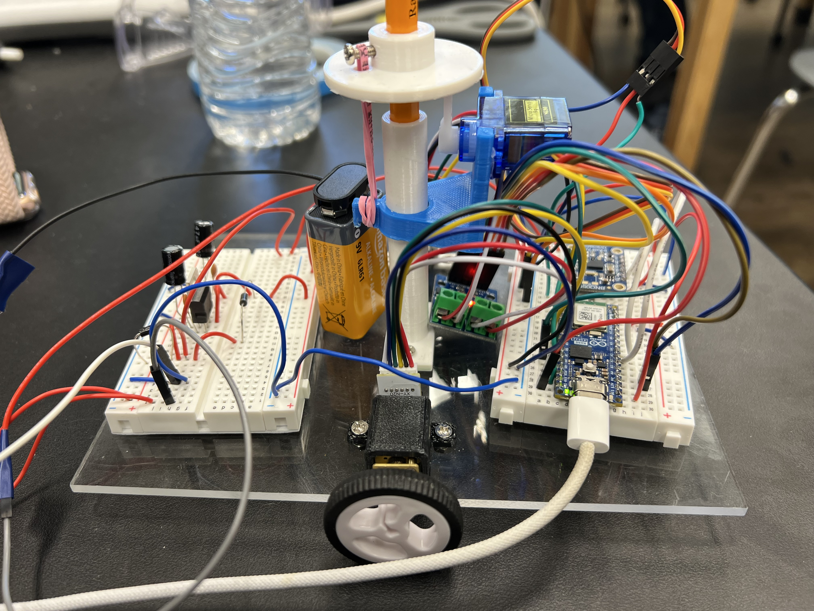
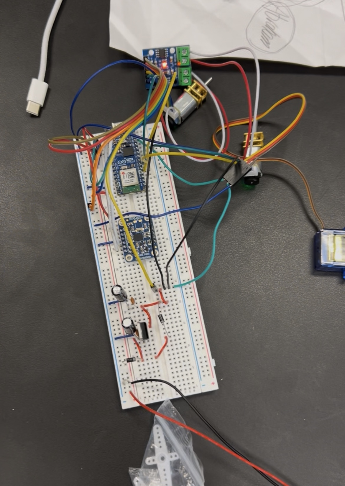
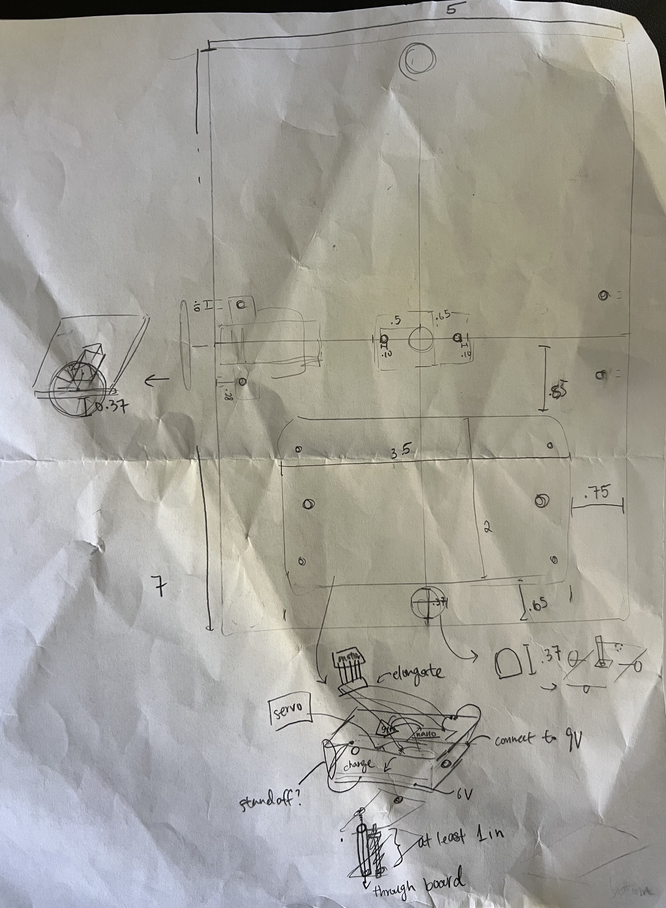
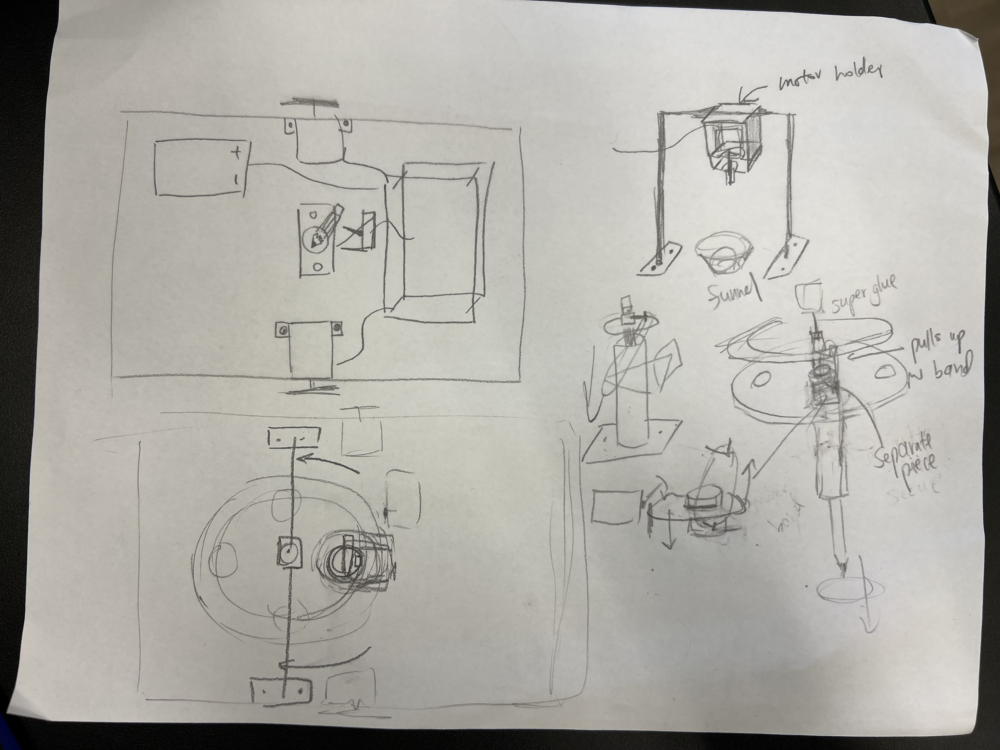

# Drawing Robot
This project is a two-wheeled drawing robot that uses an Arduino Nano ESP32, a gyroscope, motor encoders, and servo motors to draw designs on paper in different colors. Throughout this project I learned how hardware and software work together by designing circuits, writing Arduino code, debugging electrical issues, and calibrating the robot to move accurately. 

| **Engineer** | **School** | **Area of Interest** | **Grade** |
|:--:|:--:|:--:|:--:|
| Iris Z | Piedmont Hills High School | Electrical Engineering | Incoming Sophomore


## Table of Contents
- [Final Milestone](#final-milestone)
- [Second Milestone](#second-milestone)
- [First Milestone](#first-milestone)
- [Schematics](#schematics)
- [Code](#code)
- [Bill of Materials](#bill-of-materials)
- [Other Resources](#other-resources/examples)

# Final Milestone

<iframe width="560" height="315" src="https://www.youtube.com/embed/F7M7imOVGug" title="YouTube video player" frameborder="0" allow="accelerometer; autoplay; clipboard-write; encrypted-media; gyroscope; picture-in-picture; web-share" allowfullscreen></iframe>

Since my second milestone, my focus has shifted from programming/building the robot to expanding its capabilities through custom mechanical modification. 

Instead of using a single pen that moves up and down, I designed a rotating pen holder that can hold multiple colored pencils. The goal is to allow the robot to switch between colors while drawing, making more complex and colorful artwork. Designing this modification required me to use onShape to CAD my own model. Since I am low on time, I took time outside of camp to brainstorm a simple and easy way to make a rotating pen tube. The criteria are that the pencils are always needed to be up- unless pushed down to draw, and the tube itself also has to rotate. I came up with a circlish design, which looked at carefully, is basically the same as the original design, but inversed. 


I used 2 servos to make the contraption work. The first is attached to the bottom of the spinning tubes, and it can also precisely measure exactly 0-180 to get the pencil to match with the hole in the arcylic board. The other servo uses another 3D printed design I found online to use its horn to push down the pencils. Unfortunately, I overlooked the fact that servos can only rotate to 180 degrees, and not 360. Since my design uses the full circle, one of the pencils would never be used. 

Through Bluestamp, I have learned a lot about a variety of different topics I haven't even touched on before, developing new passions and skills. Some of which include circuit design, troubleshooting, CAD, and coding with C++. I have coded prior to Bluestamp, and after experiencing the engineering portion of creating. I hope to continue learning more about robotics, hardware, and more advanced engineering projects. Additionally, I decided to prioritize finishing my modifications over perfecting the Gcode callibration. So, I wish to continue working on that even after the program finishes. 


# Second Milestone

<iframe width="560" height="315" src="https://www.youtube.com/embed/qMtGFO9jP20?si=dD3OfXsuC2JakVfO" title="YouTube video player" frameborder="0" allow="accelerometer; autoplay; clipboard-write; encrypted-media; gyroscope; picture-in-picture; web-share" referrerpolicy="strict-origin-when-cross-origin" allowfullscreen></iframe>

During my second milestone, I wrote code to make the breadboard circuit into a functioning drawing robot. I mounted all of the electronics onto an acrylic board, installed the motors, wheels, pencil lift tube, and glides. Most of my time was spent developing the software that controls the robot.

Assembling the robot wasn't too bad. There were a few notable problems I had to face though. One, finding the perfect height for the glides. Being a 2-wheeled robot, it cannot balance by itself. At the 2 ends of the board (without the wheels) there are glides underneath the board to stabalize the robot. However, if the glides were too tall, the wheels wouldn't create enough friction with the ground to move, but if the glides were too short, there's literally no point in having them. Getting to the right height took meticulous sanding. Two, the motors holders weren't actually holding the robot in place, so the wheels would sometimes steer of course because of a tilt. I used Chase's 3D design to compensate, since it was tighter and properlly secured the wheels. 



One of the biggest parts of this milestone was creating a Wi-Fi control website hosted directly from the Arduino Nano ESP32. Instead of using Bluetooth, I programmed the robot to generate its own webpage where I could send movement commands and display live information from the robot. I added buttons for driving forward, backward, turning, stopping, adjusting speed, and raising or lowering the pen. I also added a calibration system and displayed the robot status directly on the webpage.

A large amount of time was spent debugging and calibrating the robot. There were may times small syntax errors or use of the wrong library caused issues that took me days to fix. For example, switching between analogWrite and digitalWrite might cause the wheels to freeze up, or adding delays on specific Wi-Fi libraries could cause everything to stop running. However, these hurdles I overcame as I program my robot results in a functioning website. The code doesn't include simple movement and turns, but uses an detailed system using the gyroscope and encoder counts to make sure the robot is moving precisely. This required measuring backlash, calculating encoder counts per millimeter, and implementing smoother acceleration and stopping behavior. The code is at the bottom of this webpage in its own section. 


By the end of this milestone, the robot was capable of:
- Driving forward!
 and backward
- Making accurate 90° turns
- Using the gyroscope to maintain a straight heading
- Measuring distance using wheel encoders (used for Gcode)
- Raising and lowering the pen with the servo
- Being controlled through a custom Wi-Fi website
- Beginning to interpret and execute G-code drawings

This milestone taught me much more about programming than I expected. I have learned a bit of coding before, but not C++, so I learned how web servers work on embedded devices, how feedback systems improve accuracy, how to debug effectively, and also a new coding language through coding with the Arduino IDE. 

Getting through milestone 2 was a huge challenge for me: one, because coding was so painstakingly tedious, but mainly because of the many, many, MANY, bugs I faced that were solved by simple solutions everyone overlooks. It wasn't extremely hard, but it ate through my time in the camp. For milestone 3, I plan to add my modification, a way to colors, as well as have the Gcode work properly and consistently. 

A carasoul with the 3d prints and stuff: 


# First Milestone

<iframe width="560" height="315" src="https://www.youtube.com/embed/goyVb42py1c?si=6O3a13vubs9H2Tlj" title="YouTube video player" frameborder="0" allow="accelerometer; autoplay; clipboard-write; encrypted-media; gyroscope; picture-in-picture; web-share" referrerpolicy="strict-origin-when-cross-origin" allowfullscreen></iframe>

For my first milestone, my goal was to get every electronic component working together before building the robot itself. I focused on wiring the entire circuit on a breadboard, testing each component individually, and making sure the Arduino Nano ESP32 could recieve instructions over Wi-Fi.

One of the biggest changes I made from the original project guide was switching several components. I replaced the Arduino Uno with an Arduino Nano ESP32 so the robot could effectively communicate over Wi-Fi instead of Bluetooth. Since the Nano ESP32 already uses 3.3V, I also no longer needed the level shifter that was originally included in the design for the gyroscope and bluetooth communicator. I also had to use an L9110 motor driver to compensate for the missing TB6612FNG motor driver with an L9110 motor driver. This required a little bit of modifying both the wiring (and later software) to match.

Starting the project was on of the hardest part, so after picking up the steam, it was much easier to get a move on. The inital wiring diagram did look complicated, but after researching each part and understanding its function, the circuit slowly began to make much more sense. Moreover, removing the bluetooth module and level shifter greatly simplified the wiring. The diagram is in the schematics section. 

During this milestone I successfully tested the servo motor, DC motors, wheel encoders, gyroscope, voltage regulator (converting 9V battery supply to 6V for powering specific components), and Wi-Fi communication separately before combining everything into one complete circuit. Majority of the hardware was brand new to me, so I learned a lot about how breadboards works, and how each of the components interact within the circuit as well as with the Arduino nano esp 32. I now know each pin has different functins as well, besides just being analog and digital. This milestone gave me a much stronger understanding of electronics and prepared me for the software portion of the project. (My next milestone)



# Schematics 

initial design for part attachment

ideas for CAD modification

wiring schematic: 

# Code

```c++
//Note: 209 tick per spin
//count per mm is around 2.02 (1.5-2)

#include <WiFi.h>
#include <Wire.h>
#include <Adafruit_Sensor.h>
#include <Adafruit_BNO055.h>
#include <ESP32Servo.h>
#include <WebServer.h>
#include <Preferences.h>  //NEW

Preferences prefs;

//set the wifi
const char* ssid = "Bluestamps-J9";
const char* password = "j9bestroom";

WebServer server(80);  //makes a server on port 80

//html
const char htmlPage[] PROGMEM = R"rawliteral(
<!DOCTYPE html>
<html>
  <head>
    <meta name="viewport" content="width=device-width, initial-scale=1.0">
    <title>Robot Control</title>
    <style>
      * {
        box-sizing: border-box;
      }

      body {
        font-family: sans-serif;
        text-align: center;
        background: #f0f0f0;
        margin: 0;
        padding: 15px;

        min-height: 100vh;
        display: flex;
        justify-content: center;
        align-items: center;
      }

      .container {
        width: 100%;
        max-width: 700px;
      }

      button {
        font-size: clamp(16px, 2vw, 22px);
        padding: clamp(8px, 1.2vw, 12px) clamp(15px, 2.5vw, 20px);
        margin: clamp(4px, 0.5vw, 5px);

        border-radius: 8px;
        border: none;
        background: #4CAF50;
        color: white;

        min-width: clamp(100px, 20vw, 220px);
      }

      button:active {
        background: #3e8e41;
      }

      #stopBtn {
        background: #f44336;
      }

      input[type=number] {
        font-size: clamp(16px, 2.5vw, 28px);
        width: clamp(70px, 12vw, 120px);
        padding: clamp(6px, 1.5vw, 12px);
        text-align: center;
      }

      #angle {
        font-size: clamp(28px, 5vw, 48px);
        font-weight: bold;
        margin: 10px;
      }

      #speed {
        font-size: clamp(24px, 4vw, 42px);
        font-weight: bold;
        margin: 10px;
        color: #0066cc;
      }

      #status {
        font-size: clamp(18px, 3vw, 30px);
        color: #333;
        margin-top: 15px;
      }
    </style>
  </head>

  <body>
    <div class="container">
      <h2>Robot Control</h2>

      <div id="angle">-- degrees</div>
      <button onclick="resetHeading()">Reset to 0</button>

      <hr>

      <div>
        <button onclick="cmd('/forward')">Forward</button>
        <button onclick="cmd('/backward')">Backward</button>
        <button id="stopBtn" onclick="cmd('/stop')">STOP</button>
      </div>

      <div>
        <button onclick="cmd('/turnLeft90')">Turn Left 90</button>
        <button onclick="cmd('/turnRight90')">Turn Right 90</button>
      </div>

      <div>
        <button style="background:#E53935" onclick="cmd('/colorRed')">Red</button>
        <button style="background:#43A047" onclick="cmd('/colorGreen')">Green</button>
        <button style="background:#1E88E5" onclick="cmd('/colorBlue')">Blue</button>
      </div>

      <div>
        <button onclick="cmd('/servo')">Pen Up / Down</button>
      </div>

      <div>
        <input type="number" id="turnDeg" value="45" step="1">
        <button onclick="customTurn()">Turn</button>
      </div>

      <hr>

      <h3>Drive Speed</h3>

      <div id="speed">--</div>

      <div>
        <button onclick="cmd('/slower')">Speed -</button>
        <button onclick="cmd('/faster')">Speed +</button>
      </div>

      <hr>

      <h3>G-code / Commands</h3>
      <textarea id="gcodeBox" rows="6" style="width:90%;font-size:16px;"
        placeholder="
        move 50 
        turn 90 
        letterD"></textarea><br>
      <button onclick="runGcode()">Run</button>

      <div>
        <button onclick="cmd('/calCW')">Calibrate CW Backlash</button>
        <button onclick="cmd('/calCCW')">Calibrate CCW Backlash</button>
      </div>

      <div id="status">Status: --</div>
    </div>

    <script>

      function cmd(path){
        fetch(path).then(r => r.text());
      }

      function customTurn(){
        var deg = document.getElementById('turnDeg').value;
        fetch('/turn?deg=' + deg).then(r => r.text());
      }

      function resetHeading(){
        fetch('/resetHeading').then(r => r.text());
      }

      function updateAngle(){
        fetch('/heading')
          .then(r => r.text())
          .then(t => {
            document.getElementById('angle').innerText = t + ' degrees';
          });
      }

      function updateStatus(){
        fetch('/status')
          .then(r => r.text())
          .then(t => {
            document.getElementById('status').innerText = 'Status: ' + t;
          });
      }

      function updateSpeed(){
        fetch('/speed')
          .then(r => r.text())
          .then(t => {
            document.getElementById('speed').innerText = t;
          });
      }

      function runGcode(){
        var code = document.getElementById('gcodeBox').value;
        fetch('/gcode', {
          method: 'POST',
          headers: { 'Content-Type': 'text/plain' },
          body: code
        }).then(r => r.text()).then(t => {
          document.getElementById('status').innerText = 'Status: ' + t;
        });
      }      

      setInterval(updateAngle,300);
      setInterval(updateStatus,300);
      setInterval(updateSpeed,300);

      updateAngle();
      updateStatus();
      updateSpeed();

    </script>
  </body>
</html>
)rawliteral";

//gcode macroX
float scaleFactor = 1.0;

const char* macroSquare =
  "G01 X0 Y100\n"
  "G01 X100 Y100\n"
  "G01 X100 Y0\n"
  "G01 X0 Y0\n";

const char* macroCircle =
  "G00 X50 Y75\n"
  "G02 X75 Y50 I0 J-25\n"
  "G02 X50 Y25 I-25 J0\n"
  "G02 X25 Y50 I0 J25\n"
  "G02 X50 Y75 I25 J0\n"
  "G00 X0 Y0\n";

const char* macroLetterD =
  "G00 X66.298464 Y86.947430\n"
  "G01 X66.298464 Y3.988280\n"
  "G01 X45.917662 Y3.988280\n"
  "G01 X45.917662 Y12.872720\n"
  "G02 X41.288188 Y7.615148 I-37.546207 J28.393745\n"
  "G02 X38.107696 Y5.233240 I-10.590575 J10.826919\n"
  "G02 X33.223581 Y3.315007 I-9.728071 J17.592189\n"
  "G02 X27.623085 Y2.630170 I-5.600496 J22.557603\n"
  "G02 X17.377553 Y5.159342 I-0.000000 J22.016620\n"
  "G02 X9.863437 Y11.967310 I9.458288 J17.990077\n"
  "G02 X5.461781 Y21.809388 I28.682839 J18.733088\n"
  "G02 X3.765244 Y34.659400 I47.816406 J12.850012\n"
  "G02 X5.812867 Y48.845666 I50.166205 J-0.000000\n"
  "G02 X10.505352 Y57.521260 I22.786055 J-6.717759\n"
  "G02 X18.253038 Y63.368711 I17.234751 J-14.779052\n"
  "G02 X27.730071 Y65.443690 I9.477033 J-20.604692\n"
  "G02 X32.709909 Y64.958296 I-0.000000 J-25.787685\n"
  "G02 X36.930852 Y63.632850 I-3.893491 J-19.782619\n"
  "G02 X40.801855 Y61.406454 I-7.919738 J-18.248365\n"
  "G02 X44.312874 Y58.200340 I-13.366421 J-18.163098\n"
  "G01 X44.312874 Y86.947430\n"
  "G01 X66.298464 Y86.947430\n"
  "G00 X44.473352 Y34.206690\n"
  "G03 X43.579704 Y40.960344 I-25.966857 J0.000000\n"
  "G03 X41.638228 Y44.732200 I-9.722445 J-2.618812\n"
  "G03 X38.371546 Y47.337134 I-7.513440 J-6.071390\n"
  "G03 X34.470178 Y48.240710 I-3.901368 J-7.970677\n"
  "G03 X31.083077 Y47.406355 I-0.000000 J-7.292218\n"
  "G03 X28.104520 Y44.901970 I4.215226 J-8.036770\n"
  "G03 X26.393647 Y41.271882 I7.449941 J-5.729397\n"
  "G03 X25.536861 Y33.697400 I33.052991 J-7.574482\n"
  "G03 X26.382123 Y26.625410 I30.006965 J-0.000000\n"
  "G03 X28.158013 Y22.888950 I9.838842 J2.386013\n"
  "G03 X31.244267 Y20.341828 I7.414821 J5.840953\n"
  "G03 X34.737642 Y19.493610 I3.493375 J6.769606\n"
  "G03 X38.489115 Y20.373484 I-0.000000 J8.437419\n"
  "G03 X41.691721 Y22.945530 I-4.262959 J8.587960\n"
  "G03 X43.562255 Y26.718858 I-7.579262 J6.107532\n"
  "G03 X44.473352 Y34.206690 I-30.313755 J7.487832\n"
  "G01 X44.473352 Y34.206690\n"
  "G00 X0.0000 Y0.0000\n";

const char* macroRoundedSquare =
  "G00 X0 Y20\n"
  "G01 X0 Y80\n"
  "G02 X20 Y100 I20 J0\n"
  "G01 X80 Y100\n"
  "G02 X100 Y80 I0 J-20\n"
  "G01 X100 Y20\n"
  "G02 X80 Y0 I-20 J0\n"
  "G01 X20 Y0\n"
  "G02 X0 Y20 I0 J20\n"
  "G00 X0 Y0\n";

const char* macroDiagonals =
  "G00 X0 Y100\n"
  "G01 X100 Y0\n"
  "G00 X100 Y100\n"
  "G01 X0 Y0\n";

const char* macroTarget =
  "G01 X0 Y100\n"
  "G01 X100 Y100\n"
  "G01 X100 Y0\n"
  "G01 X0 Y0\n"
  "G00 X50 Y75\n"
  "G02 X75 Y50 I0 J-25\n"
  "G02 X50 Y25 I-25 J0\n"
  "G02 X25 Y50 I0 J25\n"
  "G02 X50 Y75 I25 J0\n"
  "G00 X0 Y0\n"
  "G01 X100 Y100\n"
  "G00 X0 Y100\n"
  "G01 X100 Y0\n"
  "G00 X0 Y0\n";
const char* macroRainbow =
  "G00 X50 Y75\n"
  "COLORRED\n"
  "G02 X75 Y50 I0 J-25\n"
  "G02 X50 Y25 I-25 J0\n"
  "G02 X25 Y50 I0 J25\n"
  "G02 X50 Y75 I25 J0\n"
  "PENUP\n"
  "COLORGREEN\n"
  "G00 X50 Y68\n"
  "G02 X68 Y50 I0 J-18\n"
  "G02 X50 Y32 I-18 J0\n"
  "G02 X32 Y50 I0 J18\n"
  "G02 X50 Y68 I18 J0\n"
  "PENUP\n"
  "COLORBLUE\n"
  "G00 X50 Y61\n"
  "G02 X61 Y50 I0 J-11\n"
  "G02 X50 Y39 I-11 J0\n"
  "G02 X39 Y50 I0 J11\n"
  "G02 X50 Y61 I11 J0\n"
  "PENUP\n"
  "G00 X0 Y0\n";

// tuning constants
const int SERVO_FREQ_HZ = 50;
const int SERVO_MIN_US = 500;
const int SERVO_MAX_US = 2400;

//penServo pins
Servo penServo;
Servo colorServo;  // controls color wheel

const int penServoPin = 38;    // d11, was 38
const int colorServoPin = 47;  // d12, was 47

const int UP = 0;
const int DOWN = 135;
bool servoUp = true;  //up or down

// NEW color positions
const int COLOR_BLUE = 90;
const int COLOR_RED = 0;
const int COLOR_GREEN = 180;

//gyro variables
Adafruit_BNO055 bno = Adafruit_BNO055(55, 0x28);
float headingOffset = 0.0;
float heading = 0.0;
float headingGoal = 0.0;

//motor driver pins
const int A1A = A0;
const int A1B = A1;
const int B1A = A2;
const int B1B = A3;

//driving state variables
enum robotState {
  IDLE,
  FORWARD,
  BACKWARD,
  TURNING
};
robotState state = IDLE;
String turnLabel = "";

//turning variables
float turnGoal = 0.0;
const float POSSIBLE_ERROR = 0.2;

float BACKLASH_CW = 3.0;  // NEW determine via calibration
float BACKLASH_CCW = -1.0;

float lastTurnError = 0;
bool turnFirstLoop = true;
int turnPwmCap = 130;  // starts at your max, decays on overshoot
int turnPwmMin = 85;
// Encoder pins
const int encA1 = 2;  //left
const int encA2 = 4;
const int encB1 = 3;  //right
const int encB2 = 5;

volatile unsigned long lastTickA = 0;
volatile unsigned long lastTickB = 0;
volatile unsigned long tickPeriodA = 0;
volatile unsigned long tickPeriodB = 0;

volatile long encoderCountA = 0;
volatile long encoderCountB = 0;

const float TEST_DISTANCE_MM = 100.0;  //calibrating variables for counts per mm
bool calibrating = false;

//distance/position might be 2.02
const float COUNTS_PER_MM = 1.8;

float currentX = 0.0;  //xy position
float currentY = 0.0;

bool distanceMoveActive = false;  //track if move
long moveTargetCounts = 0;
long moveStartCountA = 0;

// Drive speed stuff
const float Kp = 2.5;
int baseSpeed = 190;
int leftSpeed = 0;
int rightSpeed = 0;

//BACKLASH CALIBRATE---------------

// #define SKIP_BACKLASH_CALIBRATION //uncomment this line when done
#ifndef SKIP_BACKLASH_CALIBRATION

struct CalStep {
  float turnAngle;  // 0 = no turn this step
  float moveDist;   // 0 = no move this step
  bool penDown;
  float testValue;  // NEW: backlash value being tested on this step (for status display)
};

CalStep calSteps[70];
int calStepCount = 0;
int calStepIndex = 0;
bool calRunning = false;
bool calDirectionCW = true;  // NEW: which direction the current calibration run is for

enum CalPhase {
  CAL_IDLE,
  CAL_TURN,
  CAL_MOVE
};
CalPhase calPhase = CAL_IDLE;

void buildCalSquareSequence(bool clockwise) {
  calStepCount = 0;
  calDirectionCW = clockwise;  // NEW
  float squareTurn = clockwise ? 90 : -90;
  float testValues[5] = { 4, 3, 2, 1, 0 };  // one square per candidate value

  for (int i = 0; i < 5; i++) {
    float testVal;
    if (clockwise) {
      BACKLASH_CW = testValues[i];
      testVal = testValues[i];
    } else {
      BACKLASH_CCW = -testValues[i];
      testVal = -testValues[i];
    }

    calSteps[calStepCount++] = { 0, 0, true, testVal };  // pen down
    for (int side = 0; side < 4; side++) {
      calSteps[calStepCount++] = { 0, 30, true, testVal };          // draw a side
      calSteps[calStepCount++] = { squareTurn, 0, true, testVal };  // corner turn
    }
    calSteps[calStepCount++] = { 0, 0, false, testVal };   // pen up
    calSteps[calStepCount++] = { 0, 10, false, testVal };  // reposition
    calSteps[calStepCount++] = { squareTurn, 0, false, testVal };
    calSteps[calStepCount++] = { 0, 10, false, testVal };
  }

  calStepIndex = 0;
  calPhase = CAL_IDLE;
  calRunning = true;
}

void calibrationLoop() {
  if (!calRunning) return;

  switch (calPhase) {
    case CAL_IDLE:
      {
        if (calStepIndex >= calStepCount) {
          calRunning = false;
          return;
        }
        CalStep& s = calSteps[calStepIndex];
        if (s.penDown) penDownAction();
        else penUpAction();

        if (s.turnAngle != 0) {
          startTurn(s.turnAngle);
          calPhase = CAL_TURN;
        } else if (s.moveDist != 0) {
          startDistanceMove(s.moveDist);
          calPhase = CAL_MOVE;
        } else {
          calStepIndex++;
        }
        break;
      }
    case CAL_TURN:
      if (state == IDLE) {
        calStepIndex++;
        calPhase = CAL_IDLE;
      }
      break;
    case CAL_MOVE:
      if (state == IDLE) {
        calStepIndex++;
        calPhase = CAL_IDLE;
      }
      break;
  }
}

#endif  // SKIP_BACKLASH_CALIBRATION

//END CALIBRATION---------------

//gcode variables
enum GcodePhase {
  GC_IDLE,
  GC_START,
  GC_WAIT_TURN,
  GC_WAIT_MOVE
};
GcodePhase gcodePhase = GC_IDLE;

enum ActionType {
  ACT_LINE_TO,
  ACT_TURN_REL,
  ACT_MOVE_REL,
  ACT_PEN_UP,
  ACT_PEN_DOWN,
  ACT_COLOR_RED,    // NEW
  ACT_COLOR_GREEN,  // NEW
  ACT_COLOR_BLUE    // NEW
};

struct GcodeAction {
  ActionType type;
  float value1;  // LINE_TO: target x   | TURN_REL: angle   | MOVE_REL: distance
  float value2;  // LINE_TO: target y   | unused otherwise
};

const int MAX_GCODE_ACTIONS = 500;
GcodeAction gcodeQueue[MAX_GCODE_ACTIONS];
int gcodeQueueLen = 0;
int gcodeIndex = 0;
bool gcodeRunning = false;
bool gcodePendingMove = false;  // true = "still need to drive after this turn"

float gcodeSegDist = 0, gcodeSegTargetX = 0, gcodeSegTargetY = 0;

// Position tracker used only while PARSING (building the queue) —
// separate from currentX/currentY, which track the robot's real position.
float builderX = 0, builderY = 0;


void handleRoot() {
  server.send(200, "text/html", htmlPage);
}

void handleNotFound() {  //if server not found
  String message = "File Not Found\n\n";
  message += "URI: ";
  message += server.uri();
  message += "\nMethod: ";
  message += (server.method() == HTTP_GET) ? "GET" : "POST";
  message += "\nArguments: ";
  message += server.args();
  message += "\n";
  for (uint8_t i = 0; i < server.args(); i++) {
    message += " " + server.argName(i) + ": " + server.arg(i) + "\n";
  }
  server.send(404, "text/plain", message);
}


void setup() {
  Serial.begin(115200);

  Serial.println("Type C and press enter to calibrate BNO055");  //gyro calibration only need to be done once

  ESP32PWM::allocateTimer(0);
  ESP32PWM::allocateTimer(1);
  ESP32PWM::allocateTimer(2);
  ESP32PWM::allocateTimer(3);

  colorServo.setPeriodHertz(SERVO_FREQ_HZ);
  colorServo.attach(colorServoPin, SERVO_MIN_US, SERVO_MAX_US);

  penServo.setPeriodHertz(SERVO_FREQ_HZ);
  penServo.attach(penServoPin, SERVO_MIN_US, SERVO_MAX_US);
  // penServo.detach();

  if (!bno.begin()) {  //detecting gyro
    Serial.print("Ooops, no BNO055 detected...");
    while (1)
      ;
  }
  bno.setExtCrystalUse(true);

  loadCalibrationIfSaved();  //NEW

  //set motor pins to outputs **new
  pinMode(A1A, OUTPUT);
  pinMode(A1B, OUTPUT);
  pinMode(B1A, OUTPUT);
  pinMode(B1B, OUTPUT);

  //encoder
  pinMode(encA1, INPUT_PULLUP);
  pinMode(encB1, INPUT_PULLUP);
  attachInterrupt(digitalPinToInterrupt(encA1), encoderISR_A, RISING);  //interupt every new pulse, function measures time in between
  attachInterrupt(digitalPinToInterrupt(encB1), encoderISR_B, RISING);

  // start wifi
  WiFi.begin(ssid, password);
  while (WiFi.status() != WL_CONNECTED) {
    delay(500);
    Serial.print(".");
  }
  Serial.println();
  Serial.print("Connected. IP: ");  //finally connected
  Serial.println(WiFi.localIP());

  server.on("/", handleRoot);
  server.on("/servo", servoToggle);
  server.on("/colorBlue", colorBlueToggle);
  server.on("/colorRed", colorRedToggle);
  server.on("/colorGreen", colorGreenToggle);
  server.on("/stop", stopToggle);
  server.on("/resetHeading", headingReset);
  server.on("/heading", handleHeading);
  server.on("/forward", forwardToggle);
  server.on("/backward", backwardToggle);
  server.on("/status", handleStatus);
  server.on("/turn", handleTurnArg);
  server.on("/turnRight90", []() {
    startTurn(90);
    server.send(200, "text/plain", "OK");
  });

  server.on("/turnLeft90", []() {
    startTurn(-90);
    server.send(200, "text/plain", "OK");
  });
  server.on("/faster", fasterToggle);
  server.on("/slower", slowerToggle);
  server.on("/speed", handleSpeed);
#ifndef SKIP_BACKLASH_CALIBRATION
  server.on("/calCW", []() {
    buildCalSquareSequence(true);
    server.send(200, "text/plain", "Running CW calibration");
  });
  server.on("/calCCW", []() {
    buildCalSquareSequence(false);
    server.send(200, "text/plain", "Running CCW calibration");
  });
#endif
  server.on("/gcode", HTTP_POST, []() {
    String body = server.arg("plain");
    parseGcodeText(body);
    gcodeIndex = 0;
    gcodePhase = GC_START;
    gcodeRunning = true;
    server.send(200, "text/plain", "Running " + String(gcodeQueueLen) + " actions");
  });

  server.onNotFound(handleNotFound);
  server.begin();
  Serial.println("Server has started :D");
}

void loop() {
  server.handleClient();

  displayGyro();

  //UNCOMMENT FOR CALIBRATE
  /*
    NEW calibrate gyro
    if (Serial.available()) {
      char command = Serial.read();
      if (command == 'C' || command == 'c') {
        Serial.println("Starting calibration...");
        calibrateSensor();
        Serial.println("Calibration saved!");
      }
      if (command == 'D' || command == 'd') {
        calibrateCountsPerMM();
      }
    }
    can comment above out after done calibrate
  */

  //constantly corrects angle
  if (state == FORWARD || state == BACKWARD) {
    driveStraight();

    //NEW for gcode
    if (distanceMoveActive) {  //after start cus true
      noInterrupts();
      long traveled = encoderCountA - moveStartCountA;  //keep moving
      interrupts();

      if (traveled >= moveTargetCounts) {  //until ticks reached
        brakeMotors();
        state = IDLE;
        distanceMoveActive = false;
      }
    }

  } else if (state == TURNING) {
    turnCorrect();
  }

#ifndef SKIP_BACKLASH_CALIBRATION
  calibrationLoop();
#endif
  gcodeLoop();
}

//---NEW Calibrate gyro
void calibrateSensor() {  //CALIBRATE
  //type "C" in serial monitor, sit still than rotate until all 3 and saved
  uint8_t system = 0, gyro = 0, accel = 0, mag = 0;

  while ((system < 3) || (gyro < 3) || (mag < 3)) {
    bno.getCalibration(&system, &gyro, &accel, &mag);
    //watch the values
    Serial.print("SYS:");
    Serial.print(system);
    Serial.print(" GYRO:");
    Serial.print(gyro);
    Serial.print(" ACCEL:");
    Serial.print(accel);
    Serial.print(" MAG:");
    Serial.println(mag);

    delay(200);
  }

  adafruit_bno055_offsets_t offsets;
  bno.getSensorOffsets(offsets);

  prefs.begin("bno055", false);
  prefs.putBytes("offsets", &offsets, sizeof(offsets));
  prefs.end();
}

void loadCalibrationIfSaved() {
  prefs.begin("bno055", true);
  if (prefs.isKey("offsets")) {
    adafruit_bno055_offsets_t offsets;
    prefs.getBytes("offsets", &offsets, sizeof(offsets));
    bno.setSensorOffsets(offsets);
  }
  prefs.end();
}

//finds counts per mm (encoder)
void calibrateCountsPerMM() {  //CALIBRATE

  Serial.println("Starting encoder calibration");
  Serial.println("Driving forward...");

  noInterrupts();
  encoderCountA = 0;
  encoderCountB = 0;
  interrupts();


  // Drive forward for calibration
  analogWrite(A1A, 255);
  analogWrite(A1B, LOW);
  analogWrite(B1A, 255);
  analogWrite(B1B, LOW);

  delay(500);  // time it takes for 100 mm

  brakeMotors();

  long left;
  long right;

  noInterrupts();
  left = encoderCountA;
  right = encoderCountB;
  interrupts();

  long averageCounts = (left + right) / 2;

  Serial.println("Calibration finished");

  Serial.print("Left counts: ");
  Serial.println(left);

  Serial.print("Right counts: ");
  Serial.println(right);

  Serial.print("Average counts: ");
  Serial.println(averageCounts);


  float countsPerMM = averageCounts / TEST_DISTANCE_MM;


  Serial.print("COUNTS_PER_MM = ");
  Serial.println(countsPerMM);
}
//---END NEW

void displayGyro() {  //gyro angle is constantly displayed
  sensors_event_t event;
  bno.getEvent(&event);
  heading = event.orientation.x - headingOffset;  //according to the new 0 degrees

  //keeps heading between -180 and 180
  if (heading > 180)
    heading -= 360;
  if (heading < -180)
    heading += 360;
}

void headingReset() {  //find offset
  sensors_event_t event;
  bno.getEvent(&event);

  headingOffset = event.orientation.x;

  brakeMotors();
  state = IDLE;

  server.send(200, "text/plain", "Heading Reset");
}

void handleHeading() {  //display heading on website
  server.send(200, "text/plain", String(heading, 1));
}

void brakeMotors() {
  Serial.println("in function");
  analogWrite(A1A, 255);
  analogWrite(A1B, 255);
  analogWrite(B1A, 255);
  analogWrite(B1B, 255);
  Serial.println("should have stopped");
}

void encoderISR_A() {
  unsigned long now = micros();   //gets seconds
  tickPeriodA = now - lastTickA;  //difference to get period
  lastTickA = now;                //new last tick for next time
  encoderCountA++;                //NEW
}

void encoderISR_B() {
  unsigned long now = micros();
  tickPeriodB = now - lastTickB;
  lastTickB = now;
  encoderCountB++;  //NEW
}


void penUpAction() {
  Serial.println("GO UPPPPP");
  penServo.write(UP);
  Serial.println("pen going up");
  delay(400);
  servoUp = true;
}

void penDownAction() {
  penServo.write(DOWN);
  Serial.println("pen going down");
  delay(400);
  servoUp = false;
}

void servoToggle() {  // still the /penServo handler
  if (servoUp) penDownAction();
  else penUpAction();
  server.send(200, "text/plain", servoUp ? "Pencil Up" : "Pencil Down");
}


//color change servo
void moveColorServoToAngle(int angle) {
  colorServo.write(angle);
  Serial.print("color wheel moving to angle: ");
  Serial.println(angle);
  delay(400);
}

void colorBlueToggle() {
  moveColorServoToAngle(COLOR_BLUE);
  server.send(200, "text/plain", "Blue");
}

void colorRedToggle() {
  moveColorServoToAngle(COLOR_RED);
  server.send(200, "text/plain", "Red");
}

void colorGreenToggle() {
  moveColorServoToAngle(COLOR_GREEN);
  server.send(200, "text/plain", "Green");
}

void forwardToggle() {
  //force out
  distanceMoveActive = false;
  gcodeRunning = false;
  gcodePhase = GC_IDLE;
  gcodePendingMove = false;
#ifndef SKIP_BACKLASH_CALIBRATION
  calRunning = false;
  calPhase = CAL_IDLE;
#endif
  brakeMotors();  //stops gcode now

  headingGoal = heading;  //current heading is line to hold
  state = FORWARD;

  server.send(200, "text/plain", "Driving Forward");
}

void backwardToggle() {
  distanceMoveActive = false;
  gcodeRunning = false;
  gcodePhase = GC_IDLE;
  gcodePendingMove = false;
#ifndef SKIP_BACKLASH_CALIBRATION
  calRunning = false;
  calPhase = CAL_IDLE;
#endif
  brakeMotors();

  headingGoal = heading;
  state = BACKWARD;

  server.send(200, "text/plain", "Driving Backward");
}

void driveStraight() {
  //get degree error
  float error = headingGoal - heading;
  //shortest adjustment
  if (error > 180) error -= 360;
  if (error < -180) error += 360;

  int steerCorrection = error * Kp;
  steerCorrection = constrain(steerCorrection, -30, 30);

  if (state == BACKWARD) {
    steerCorrection = -steerCorrection;
  }

  //corrects speed
  rightSpeed = baseSpeed - steerCorrection;
  leftSpeed = baseSpeed + steerCorrection;

  // --- NEW: wheel-speed balancing from encoders ---
  noInterrupts();
  unsigned long pA = tickPeriodA;
  unsigned long pB = tickPeriodB;
  interrupts();

  if (pA > 0 && pB > 0) {
    int balanceError = (int)(abs((long)(pA - pB)) * baseSpeed / (long)pA);
    if (pA > pB) rightSpeed -= balanceError;       // right wheel turning faster than left → slow it
    else if (pA < pB) rightSpeed += balanceError;  // right wheel slower → speed it up
  }
  // ---END NEW

  leftSpeed = constrain(leftSpeed, 0, 255);
  rightSpeed = constrain(rightSpeed, 0, 255);

  if (state == FORWARD) {
    analogWrite(A1A, leftSpeed);
    analogWrite(A1B, LOW);
    analogWrite(B1A, rightSpeed);
    analogWrite(B1B, LOW);


  } else if (state == BACKWARD) {
    analogWrite(A1A, LOW);
    analogWrite(A1B, leftSpeed);
    analogWrite(B1A, LOW);
    analogWrite(B1B, rightSpeed);
  }
}

void stopToggle() {
  state = IDLE;

  //stop can stop everything
  distanceMoveActive = false;

  gcodeRunning = false;
  gcodePhase = GC_IDLE;
  gcodePendingMove = false;

#ifndef SKIP_BACKLASH_CALIBRATION
  calRunning = false;
  calPhase = CAL_IDLE;
#endif

  brakeMotors();
  server.send(200, "text/plain", "stopped");
}

void startTurn(float angle) {
  //NEW
  float backlashComp = (angle > 0) ? BACKLASH_CW : BACKLASH_CCW;

  turnGoal = heading + angle + backlashComp;
  //shortest turn angle
  if (turnGoal > 180) turnGoal -= 360;
  if (turnGoal < -180) turnGoal += 360;

  turnFirstLoop = true;  // NEW — reset once per turn, not per loop iteration
  turnPwmCap = 130;      // also reset the cap again
  turnLabel = (angle > 0) ? "Turning Right" : "Turning Left";
  state = TURNING;
}

void handleTurnArg() {
  if (server.hasArg("deg")) {
    float deg = server.arg("deg").toFloat();
    //turn any degree
    startTurn(deg);  //turn right
    server.send(200, "text/plain", "received");
  } else {
    server.send(400, "text/plain", "Missing degree parameter");
  }
}

void turnCorrect() {  //basic 90 deg turns
  //-NEW
  float error = turnGoal - heading;
  if (error > 180) error -= 360;
  if (error < -180) error += 360;

  if (!turnFirstLoop && (error * lastTurnError < 0)) {
    // overshot — brake and reduce speed cap
    brakeMotors();
    delay(20);
    turnPwmCap = max((int)(turnPwmCap * 0.7), turnPwmMin);
  }
  turnFirstLoop = false;
  lastTurnError = error;

  int turnSpeed = map(abs(error), 0, 90, turnPwmMin, turnPwmCap);
  turnSpeed = constrain(turnSpeed, turnPwmMin, turnPwmCap);

  if (error < 0) {
    analogWrite(A1A, LOW);
    analogWrite(A1B, turnSpeed);
    analogWrite(B1A, turnSpeed);
    analogWrite(B1B, LOW);
  } else {
    analogWrite(A1A, turnSpeed);
    analogWrite(A1B, LOW);
    analogWrite(B1A, LOW);
    analogWrite(B1B, turnSpeed);
  }

  if (abs(error) <= POSSIBLE_ERROR) {
    brakeMotors();
    state = IDLE;
    turnPwmCap = 130;  // reset for next turn
  }
}

void fasterToggle() {
  baseSpeed += 10;
  baseSpeed = constrain(baseSpeed, 50, 250);
  server.send(200, "text/plain", String(baseSpeed));
}

void slowerToggle() {
  baseSpeed -= 10;
  baseSpeed = constrain(baseSpeed, 50, 250);
  server.send(200, "text/plain", String(baseSpeed));
}

void handleSpeed() {
  server.send(200, "text/plain", String(baseSpeed));
}

void handleStatus() {
#ifndef SKIP_BACKLASH_CALIBRATION
  if (calRunning) {
    // NEW: live calibration status, e.g. "CW, backlash = 3.0"
    String dirLabel = calDirectionCW ? "CW" : "CCW";
    float shownValue = 0;
    if (calStepIndex < calStepCount) {
      shownValue = calSteps[calStepIndex].testValue;
    }
    server.send(200, "text/plain", dirLabel + ", backlash = " + String(shownValue, 1));
    return;
  }
#endif

  String text;
  switch (state) {
    case IDLE: text = "Stopped"; break;
    case FORWARD: text = "Moving Forward"; break;
    case BACKWARD: text = "Moving Backward"; break;
    case TURNING: text = turnLabel; break;
  }
  server.send(200, "text/plain", text);
}

//NEW distance functions distance(40 or something)
void startDistanceMove(float distanceMM) {
  moveTargetCounts = (long)(fabs(distanceMM) * COUNTS_PER_MM);  //converts to ticks

  noInterrupts();
  moveStartCountA = encoderCountA;  //ticks go to here
  interrupts();

  headingGoal = heading;  // hold current heading while moving straight
  distanceMoveActive = true;
  state = (distanceMM >= 0) ? FORWARD : BACKWARD;
}

//NEW GCODE STUFF------------------------------------------

void enqueueAction(ActionType type, float v1 = 0, float v2 = 0) {
  if (gcodeQueueLen >= MAX_GCODE_ACTIONS) return;  // queue full — raise MAX_GCODE_ACTIONS if this happens
  gcodeQueue[gcodeQueueLen].type = type;
  gcodeQueue[gcodeQueueLen].value1 = v1;
  gcodeQueue[gcodeQueueLen].value2 = v2;
  gcodeQueueLen++;
}

void parseGcodeText(String text) {
  gcodeQueueLen = 0;
  gcodeIndex = 0;
  builderX = currentX;
  builderY = currentY;

  text.trim();
  String upperText = text;
  upperText.toUpperCase();

  // If the whole box is just one keyword, swap in that macro's G-code
  //add new gcode here each time
  if (upperText == "LETTERD") text = macroLetterD;
  else if (upperText == "SQUARE") text = macroSquare;
  else if (upperText == "CIRCLE") text = macroCircle;
  else if (upperText == "ROUNDEDSQUARE") text = macroRoundedSquare;
  else if (upperText == "DIAGONALS") text = macroDiagonals;
  else if (upperText == "TARGET") text = macroTarget;
  else if (upperText == "RAINBOW") text = macroRainbow;

  int start = 0;
  while (start < (int)text.length()) {
    int nl = text.indexOf('\n', start);
    String line = (nl == -1) ? text.substring(start) : text.substring(start, nl);
    parseGcodeLine(line);
    if (nl == -1) break;
    start = nl + 1;
  }
}

void startGcodeAction() {
  if (gcodeIndex >= gcodeQueueLen) {
    gcodeRunning = false;
    gcodePhase = GC_IDLE;
    return;
  }

  GcodeAction& a = gcodeQueue[gcodeIndex];

  switch (a.type) {
    case ACT_PEN_UP:
      penUpAction();
      gcodeIndex++;
      gcodePhase = GC_START;
      break;

    case ACT_PEN_DOWN:
      penDownAction();
      gcodeIndex++;
      gcodePhase = GC_START;
      break;

    case ACT_COLOR_RED:
      moveColorServoToAngle(COLOR_RED);
      gcodeIndex++;
      gcodePhase = GC_START;
      break;

    case ACT_COLOR_GREEN:
      moveColorServoToAngle(COLOR_GREEN);
      gcodeIndex++;
      gcodePhase = GC_START;
      break;

    case ACT_COLOR_BLUE:
      moveColorServoToAngle(COLOR_BLUE);
      gcodeIndex++;
      gcodePhase = GC_START;
      break;
    
    case ACT_TURN_REL:
      startTurn(a.value1);
      gcodePendingMove = false;
      gcodePhase = GC_WAIT_TURN;
      break;

    case ACT_MOVE_REL:
      {
        float rad = heading * PI / 180.0;
        gcodeSegTargetX = currentX + a.value1 * cos(rad);
        gcodeSegTargetY = currentY + a.value1 * sin(rad);
        startDistanceMove(a.value1);
        gcodePhase = GC_WAIT_MOVE;
        break;
      }

    case ACT_LINE_TO:
      {
        float dx = a.value1 - currentX;
        float dy = a.value2 - currentY;
        float targetAngle = atan2(dy, dx) * 180.0 / PI;

        float turnAmount = targetAngle - heading;
        if (turnAmount > 180) turnAmount -= 360;
        if (turnAmount < -180) turnAmount += 360;

        gcodeSegDist = sqrt(dx * dx + dy * dy);
        gcodeSegTargetX = a.value1;
        gcodeSegTargetY = a.value2;

        if (fabs(turnAmount) > 0.5) {
          startTurn(turnAmount);
          gcodePendingMove = true;
          gcodePhase = GC_WAIT_TURN;
        } else {
          startDistanceMove(gcodeSegDist);
          gcodePendingMove = false;
          gcodePhase = GC_WAIT_MOVE;
        }
        break;
      }
  }
}

void gcodeLoop() {
  if (!gcodeRunning) return;

  switch (gcodePhase) {
    case GC_START:
      startGcodeAction();
      break;

    case GC_WAIT_TURN:
      if (state == IDLE) {
        if (gcodePendingMove) {
          startDistanceMove(gcodeSegDist);
          gcodePhase = GC_WAIT_MOVE;
        } else {
          gcodeIndex++;
          gcodePhase = GC_START;
        }
      }
      break;

    case GC_WAIT_MOVE:
      if (state == IDLE) {
        currentX = gcodeSegTargetX;
        currentY = gcodeSegTargetY;
        gcodeIndex++;
        gcodePhase = GC_START;
      }
      break;

    default:
      break;
  }
}

float getGcodeValue(const String& cmd, char code, float defaultValue) {
  int start = cmd.indexOf(code);
  if (start == -1) return defaultValue;
  int pos = start + 1;
  while (pos < (int)cmd.length() && cmd[pos] == ' ') pos++;
  int end = pos;
  while (end < (int)cmd.length() && (isDigit(cmd[end]) || cmd[end] == '.' || cmd[end] == '-')) {
    end++;
  }
  return cmd.substring(pos, end).toFloat() * scaleFactor;  //scale factor could be anything greater than 0
}

void enqueueArc(float targetX, float targetY, float I, float J, bool cw) {
  float centerX = builderX + I;
  float centerY = builderY + J;
  float radius = sqrt(I * I + J * J);

  float startAngle = atan2(builderY - centerY, builderX - centerX);
  float endAngle = atan2(targetY - centerY, targetX - centerX);
  if (startAngle < 0) startAngle += 2 * PI;
  if (endAngle < 0) endAngle += 2 * PI;

  float arcAngle = cw ? fmod((startAngle - endAngle + 2 * PI), 2 * PI)
                      : fmod((endAngle - startAngle + 2 * PI), 2 * PI);

  const float maxAngleStep = PI / 9.0;  // ~20 degrees per straight segment
  int segments = max(1, (int)(arcAngle / maxAngleStep));

  for (int s = 1; s <= segments; s++) {
    float theta = cw ? (startAngle - (arcAngle * s / segments))
                     : (startAngle + (arcAngle * s / segments));
    float px = centerX + radius * cos(theta);
    float py = centerY + radius * sin(theta);
    enqueueAction(ACT_LINE_TO, px, py);
  }

  builderX = targetX;
  builderY = targetY;
}

void parseGcodeLine(String line) {
  line.trim();
  if (line.length() == 0) return;
  line.toUpperCase();

  // --- Plaintext commands ---
  if (line.startsWith("MOVE")) {
    float dist = line.substring(4).toFloat() * scaleFactor;
    enqueueAction(ACT_MOVE_REL, dist);
    return;
  }
  if (line.startsWith("TURN")) {
    float ang = line.substring(4).toFloat();
    enqueueAction(ACT_TURN_REL, ang);
    return;
  }
  if (line.startsWith("PENUP")) {
    enqueueAction(ACT_PEN_UP);
    return;
  }
  if (line.startsWith("PENDOWN")) {
    enqueueAction(ACT_PEN_DOWN);
    return;
  }

  if (line.startsWith("COLORRED")) {
    enqueueAction(ACT_COLOR_RED);
    return;
  }
  if (line.startsWith("COLORGREEN")) {
    enqueueAction(ACT_COLOR_GREEN);
    return;
  }
  if (line.startsWith("COLORBLUE")) {
    enqueueAction(ACT_COLOR_BLUE);
    return;
  }

  if (line.startsWith("SCALE")) {
    float s = line.substring(5).toFloat();
    if (s > 0) scaleFactor = s;
    return;
  }


  // --- G-code: straight lines ---
  if (line.startsWith("G00") || line.startsWith("G01")) {
    bool penDown = line.startsWith("G01");
    float x = getGcodeValue(line, 'X', builderX);
    float y = getGcodeValue(line, 'Y', builderY);
    static bool builderPenDown = false;  // tracks intended pen state during parse
    if (penDown != builderPenDown) {
      enqueueAction(penDown ? ACT_PEN_DOWN : ACT_PEN_UP);
      builderPenDown = penDown;
    }
    enqueueAction(ACT_LINE_TO, x, y);
    builderX = x;
    builderY = y;
    return;
  }

  // --- G-code: arcs ---
  if (line.startsWith("G02") || line.startsWith("G03")) {
    bool cw = line.startsWith("G02");
    float x = getGcodeValue(line, 'X', builderX);
    float y = getGcodeValue(line, 'Y', builderY);
    float i = getGcodeValue(line, 'I', 0);
    float j = getGcodeValue(line, 'J', 0);
    enqueueAction(ACT_PEN_DOWN);
    enqueueArc(x, y, i, j, cw);
    return;
  }
}

```

# Bill of Materials
Here's where you'll list the parts in your project. To add more rows, just copy and paste the example rows below.
Don't forget to place the link of where to buy each component inside the quotation marks in the corresponding row after href =. Follow the guide [here]([url](https://www.markdownguide.org/extended-syntax/)) to learn how to customize this to your project needs. 

| **Part** | **Note** | **Price** | **Link** |
|:--:|:--:|:--:|:--:|
| Item Name | What the item is used for | $Price | <a href="https://www.amazon.com/Arduino-A000066-ARDUINO-UNO-R3/dp/B008GRTSV6/"> Link </a> |
| Item Name | What the item is used for | $Price | <a href="https://www.amazon.com/Arduino-A000066-ARDUINO-UNO-R3/dp/B008GRTSV6/"> Link </a> |
| Item Name | What the item is used for | $Price | <a href="https://www.amazon.com/Arduino-A000066-ARDUINO-UNO-R3/dp/B008GRTSV6/"> Link </a> |

# Other Resources/Examples
My original inspiration is lingib's instructables page. His page is what gave me the boost to start my project off well, and have a general idea of what the circuit and pencil lift contraption should be like. Addionally he provided great insight on the theory of how the code should be written to account for variables such as backlash. 
- [Instructables page]([https://trashytuber.github.io/YimingJiaBlueStamp/](https://www.instructables.com/Gyro-Controlled-Robot-Plotter/))
  
I also used the 3D designs of other people for my servo holders, linked below: 
- [Linear Actuator Model]([https://sviatil0.github.io/Sviatoslav_BSE/](https://grabcad.com/library/small-linear-actuator-for-mg90s-and-similar-1))
- [Vertical Servo Holder]([https://arneshkumar.github.io/arneshbluestamp/](https://makerworld.com/en/models/2391579-micro-servo-sg90-9g-vertical-bracket-12mm-raised?from=search#profileId-2620119))
